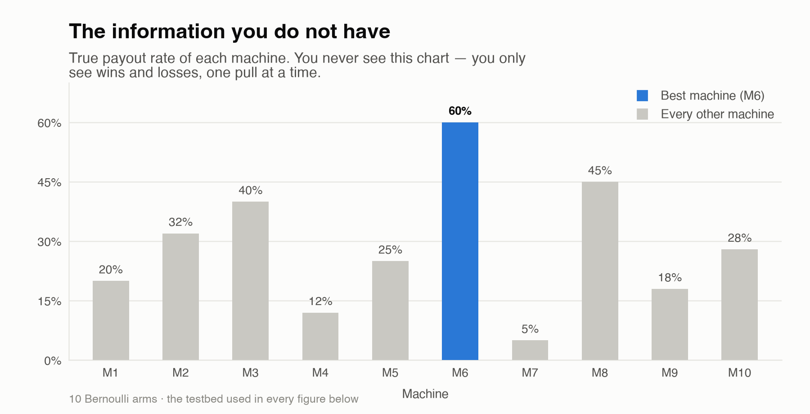
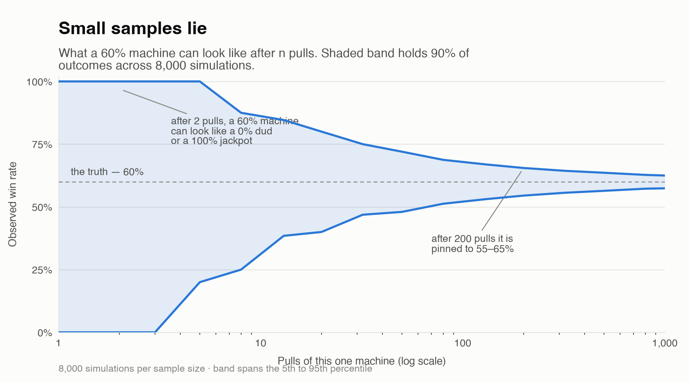
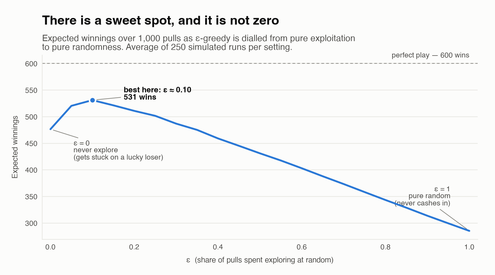
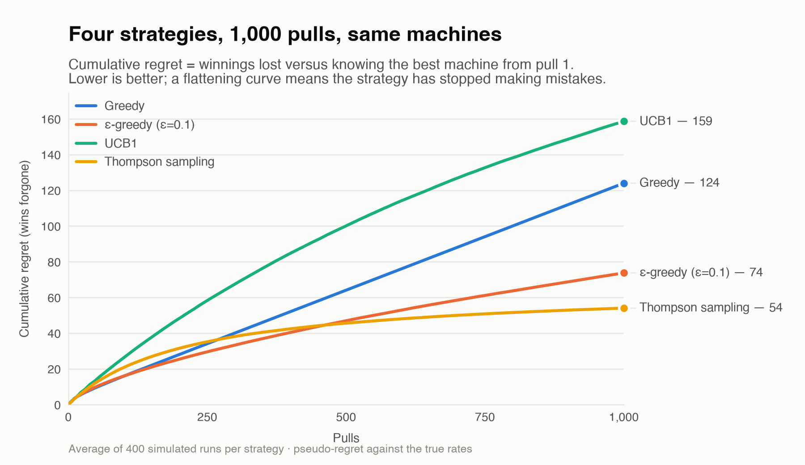
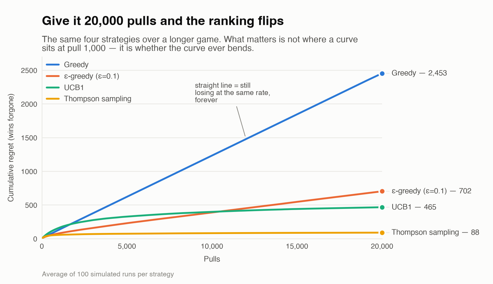
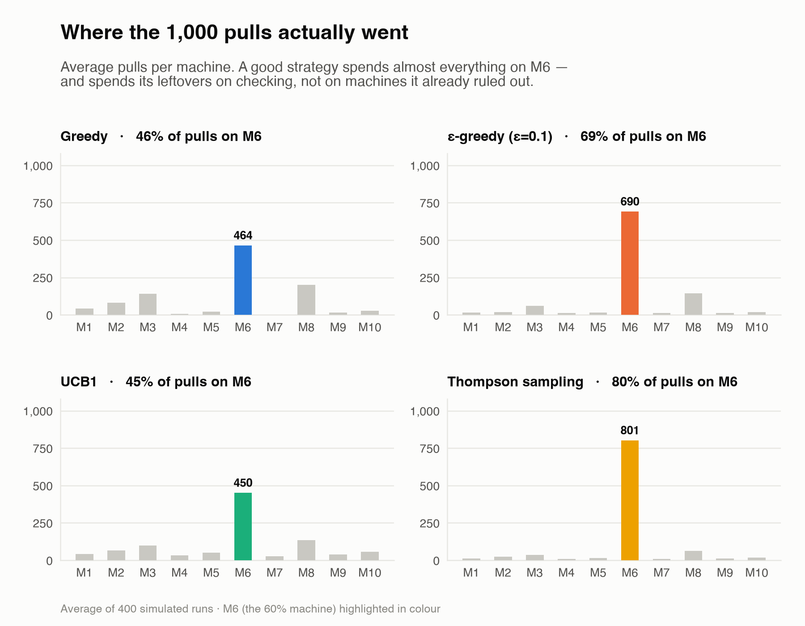
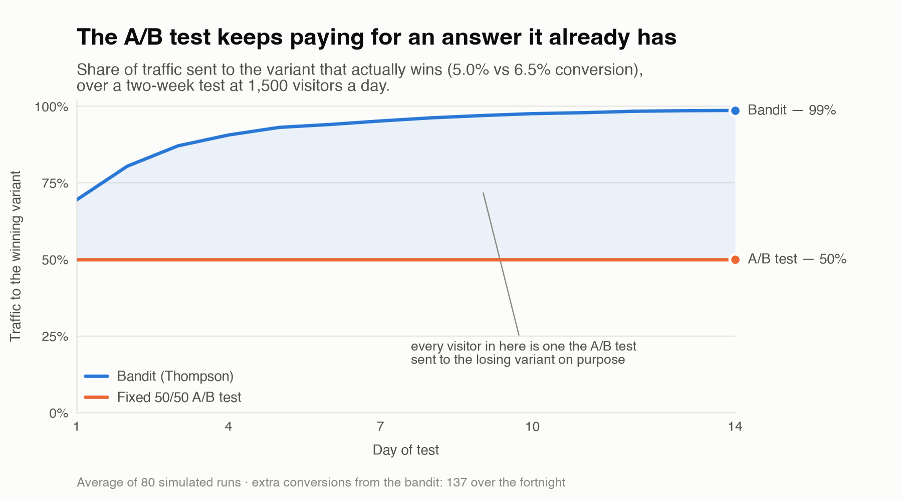

# The Multi-Armed Bandit Problem

*You can't learn without spending, and you can't spend well without learning.*

---

## 1. The story it's named after

A "one-armed bandit" is old slang for a slot machine — one lever, and it robs you. So
picture a room with **ten slot machines**, each with its own hidden payout rate. One of
them pays out 60% of the time. Another pays 5%. **You don't know which is which.**

You have 1,000 pulls. Maximize your winnings.

That's the whole problem. Here is the answer key:



You never get to see this chart. You see one pull at a time — win, lose, lose, win — and
from that dribble of evidence you have to decide where the next coin goes. Every figure
below uses these same ten machines.

---

## 2. The core tension

Every single pull, you face the same fork:

- **Exploit** — pull the machine that has looked best so far. Cash in on what you know.
- **Explore** — pull a different machine. Maybe there's something better out there.

You cannot do both with one pull. Every pull spent exploring is a pull you didn't spend
earning; every pull spent earning is a pull that taught you nothing new.

That's the entire field in one sentence: the **explore/exploit tradeoff**.

---

## 3. Why it's genuinely hard

The trap is that **small samples lie.**

Pull a machine twice, win both times — 100% win rate! Pull another twice, lose both — 0%!
Obvious answer, right? Except the first is really a 30% machine that got lucky and the
second is really a 60% machine that got unlucky. Commit now and you'll spend the next 996
pulls on the worse machine and *never find out*, because you stopped sampling the other one.

Here's how wide that lie can be. This is one machine with a true rate of 60%, simulated
8,000 times at each sample size:



After two pulls, a 60% machine can honestly look like a 0% dud or a 100% jackpot. After
five pulls it can still look like anything from 20% to 100%. Only in the low hundreds does
the evidence get tight enough to trust.

So both failure modes are real, and they pull in opposite directions:

- **Commit too early** and you get stuck on a lucky loser, forever, with a confident
  little four-sample story about why it's the best.
- **Explore too long** and you learn the true rates beautifully while winning almost
  nothing, because you spent your money confirming what you already knew.

There's no safe option. You are always paying for information with money, or paying for
money with ignorance.

### Regret

The standard way to score this is **regret**: the difference between what you actually won
and what you would have won if you'd magically known the best machine from pull one.

Zero regret is impossible — you have to learn somehow, and learning costs pulls. The real
goal is regret that **grows slowly**, and ideally that stops growing at all. Hold onto that
distinction; it turns out to be the thing that matters most.

### There is a sweet spot, and it isn't zero

Before getting to clever strategies, here's the tradeoff made literal. Take the simplest
possible knob — "what fraction of my pulls should be random exploration?" — and sweep it
from 0 to 1:



Never exploring wins 476. Always exploring wins 285. Spending **about 10% of your pulls on
exploration wins 531** — better than either extreme, and the curve punishes you far more
gently for exploring slightly too much than for exploring too little. Perfect play would
be 600.

The lesson generalizes well beyond slot machines: a little bit of deliberate,
"wasteful" exploration is not a tax on performance. It *is* performance.

---

## 4. Four strategies

**Greedy.** Try each machine once, then hammer whichever won. Fast, simple, and frequently
wrong forever — this is the lucky-loser failure with no way out.

**ε-greedy.** 90% of the time pull your current best; 10% of the time pull a machine at
random. That 10% is your insurance policy against being wrong. Dumb-simple, and it works
shockingly well. But it's dumb in a specific way: the random exploration keeps spending
pulls on machines you've *already* proven terrible. If M7 has lost 200 times in a row, you
don't need to keep checking.

**UCB (Upper Confidence Bound).** "Optimism in the face of uncertainty." Rank each machine
not by its average, but by the *best it could plausibly be* given how little you know:

```
score = observed mean + sqrt(2 · ln t / n)
```

A machine pulled twice has a huge error bar, so its optimistic ceiling is high — go look.
A machine pulled 300 times has a tight error bar, so its ceiling ≈ its average. Uncertainty
itself becomes a reason to try something. The elegant part: exploring a machine shrinks its
error bar, which lowers its optimism, which makes you stop exploring it. **The strategy
retires its own curiosity** — no hand-tuned 10% required.

**Thompson sampling.** Instead of one number per machine, keep a *belief distribution*:
"M6 is probably around 35%, could be 25%, could be 45%." Each round, draw one random guess
from each machine's belief and pull whichever guess came out highest.

Machines you're unsure about have wide beliefs, so they sometimes draw high and get picked.
Machines you're confident are bad rarely draw high. You end up trying each machine roughly
in proportion to **the probability that it is actually the best one** — which is exactly
the right amount of attention to pay. It's Bayesian, it's about five lines of code, and in
practice it is very hard to beat.

---

## 5. The showdown (and a surprise)

Same ten machines, 1,000 pulls, 400 simulated runs each:



| Strategy | Regret @250 | @500 | @1,000 |
|---|---:|---:|---:|
| Greedy | 34 | 64 | **124** |
| ε-greedy (ε=0.1) | 30 | 47 | **74** |
| UCB1 | 58 | 100 | **159** |
| Thompson sampling | 35 | 46 | **54** |

Thompson wins, as advertised. But **UCB1 came dead last — worse than plain greedy**, which
inverts the tidy "dumbest to smartest" ordering from §4.

It isn't a bug: UCB1 hasn't finished. To rule an arm out it needs pulls proportional to
`1/Δ²`, the inverse square of that arm's gap. The runner-up M8 sits just 0.15 below the
best machine, and closing a gap that narrow takes **around 600 pulls of M8 alone** — most
of a 1,000-pull budget, for one machine out of ten. UCB1 spends the whole game still
auditing.

So the table isn't a verdict on UCB1. It's a verdict on the horizon.

---

## 6. What actually matters: does the curve bend?

Same four strategies, same machines, 20,000 pulls:



| Strategy | @1,000 | @5,000 | @10,000 | @20,000 | Shape |
|---|---:|---:|---:|---:|---|
| Greedy | 130 | 620 | 1,232 | **2,453** | linear — never recovers |
| ε-greedy (ε=0.1) | 77 | 228 | 387 | **702** | linear — the 10% tax never ends |
| UCB1 | 159 | 326 | 396 | **465** | sublinear — bends |
| Thompson sampling | 54 | 72 | 80 | **88** | sublinear — nearly flat |

The ranking flips completely. UCB1 goes from worst to second. Greedy goes from respectable
to catastrophic, and its curve is a **straight line** — it is losing at a constant rate and
will keep doing so until the heat death of the universe, because in the runs where it
locked onto the wrong machine there is no mechanism that could ever unlock it.

ε-greedy's line is also essentially straight, for a subtler reason. It permanently spends
10% of pulls at random, and a random machine gives up about 0.315 wins on average, so over
20,000 pulls that's `0.1 × 0.315 × 20,000 ≈ 630` wins of pure tax — nearly all of its 702.
**ε-greedy never stops paying for exploration it no longer needs.** It just pays at a rate
you chose in advance.

UCB1 and Thompson bend because their exploration is *self-extinguishing*: evidence shrinks
uncertainty, and uncertainty is the only thing that buys a machine a pull.

> The real lesson of the surprise in §5: **where a curve sits at your horizon and what
> shape the curve is are two different questions.** A strategy that looks bad at 1,000
> pulls may simply be one that hasn't finished paying its tuition. A strategy that looks
> fine may be one whose bill never stops arriving. Always ask which you're looking at.

### Where the pulls went

The same runs, viewed as "how did you actually spend your money":



This is the whole article in one picture. Thompson puts **80%** of its pulls on the best
machine and spends its leftovers mostly on M8 — the 45% runner-up, the only machine whose
identity is genuinely still in question. Greedy manages 46% and dumps a fifth of its budget
on M8 because it locked on and never re-checked. ε-greedy gets to 69%, but look at the
scatter across M1–M10: that's the random tax, sprinkled evenly over machines it has no
reason left to doubt. UCB1, at 45%, is still deliberately auditing everything — the
behavior that costs it at 1,000 pulls and wins it second place at 20,000.

---

## 7. Where you actually meet this

The slot machines are a cover story. The real pattern is **repeated choice under
uncertainty, where you only learn from the option you picked** — you never find out what
the road not taken would have paid. That shape is everywhere:

- **Headline and thumbnail testing.** Netflix picking which poster to show you. Every
  impression is a pull.
- **Ad selection.** Which of fifty creatives to serve. This is the industry that funded
  most of the modern research.
- **Recommendations.** Show the safe hit, or the risky new thing that might become your
  favorite? A recommender that only exploits plays you the same five songs forever.
- **Clinical trials.** Here regret isn't money — it's patients on the worse treatment.
  Adaptive trials shift assignment toward the winning arm as evidence accumulates.
- **Your own life.** The restaurant you love versus the new place. Same job versus new job.
  Genuinely the same math, which is why the framing is weirdly useful to carry around.

### The big upgrade: contextual bandits

Classic bandits assume one machine is best, period. In the real world **the best choice
depends on who's asking** — a horror-movie thumbnail is the best pull for some viewers and
the worst for others.

A **contextual bandit** sees features first (time of day, user history, device), *then*
picks. You're no longer learning "which arm is best" but "which arm is best **given this
situation**" — a policy instead of a single answer. This is what production recommendation
and ad systems actually run.

---

## 8. Bandits versus A/B tests

This is the practical punchline.

A classic **A/B test** splits traffic 50/50, runs for two weeks, and then you read the
result and switch. Which means you knowingly send half your traffic to the losing variant
for the *entire* test — including on day 12, when it's already obvious which one lost.

A **bandit** shifts traffic toward the winner continuously, as evidence accumulates. Here's
a fortnight-long test of a 5.0% variant against a 6.5% variant at 1,500 visitors a day:



The bandit is sending **69% of traffic to the winner by the end of day one** and 99% by day
fourteen. That shaded gap is not abstract — over the fortnight it's **137 extra
conversions** (1,344 vs 1,207, an 11% lift) from the identical two variants and the
identical traffic. The only thing that changed is that one design kept paying for an answer
it already had.

**So why ever run an A/B test?** Because the two tools answer different questions. An A/B
test hands you a clean, defensible statistical statement: "B beat A by 3.2%, p < 0.05."
A bandit optimizes the outcome but muddies the inference — your sample sizes are now
unequal *and correlated with the results themselves*, which breaks the assumptions behind
a naive p-value.

> **Bandit when you want to win. A/B test when you need to know why**, or need to defend
> the number to someone who will ask.

### When a bandit is the wrong tool

Worth saying plainly, because bandits get oversold:

- **Slow feedback.** Bandits need the reward before the next decision. If conversion takes
  30 days to observe, there's nothing to adapt on.
- **Non-stationary rewards.** These algorithms assume the machines don't change. If the
  best variant shifts with the season, plain Thompson will be over-confident in stale
  evidence — you need a discounted or sliding-window variant.
- **You need the counterfactual.** If the goal is a trustworthy effect size for a decision
  you'll defend later, deliberately balanced traffic is a feature, not waste.
- **Very few decisions.** With 200 total visitors there isn't enough signal for adaptation
  to beat a clean split.

---

## The whole thing in one line

You can't learn without spending, and you can't spend well without learning — so the art is
spending just enough on learning that you don't spend the rest of your life on a mistake.

---

## Reproducing the figures

```bash
python3 -m venv .venv
.venv/bin/pip install matplotlib numpy
.venv/bin/python bandit_sim.py        # ~40s; writes images/*.png and images/data.json
```

[`bandit_sim.py`](bandit_sim.py) contains all four strategies, the testbed, and the plotting
code; [`images/data.json`](images/data.json) has the raw numbers behind every chart. Runs
are seeded, so the figures regenerate identically.

### Caveats on the numbers

These are honest results from **one testbed**, and the ranking is not a universal law:

- The gap between best (60%) and runner-up (45%) is generous. Narrow the gap and everything
  gets harder and slower, UCB1 especially.
- UCB1 here is the textbook version with the constant 2, which is known to be conservative.
  Tuned variants (UCB-V, KL-UCB, or simply a smaller constant) close most of the gap to
  Thompson at short horizons. §5 is about *this* formula's pace, not the idea behind it.
- ε-greedy is run at a fixed ε=0.1. A *decaying* ε gets you sublinear regret and would bend
  like the other two — the flat 10% tax in §6 is a consequence of the fixed setting, not of
  the algorithm family.
- Regret is reported as **pseudo-regret** (measured against the true rates rather than the
  realized coin flips), which is standard and much less noisy.
